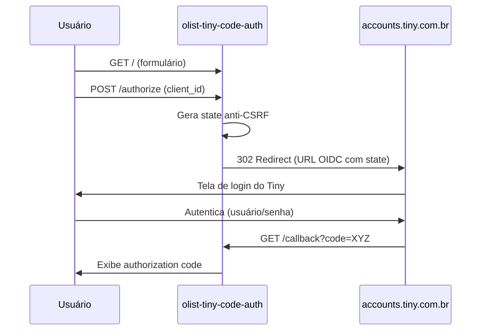

# Arquitetura

Visão geral do fluxo OAuth2 authorization-code implementado por esta aplicação.

---

## Fluxo completo



---

## Componentes

| Arquivo                  | Responsabilidade                                                       |
|--------------------------|------------------------------------------------------------------------|
| `app.py`                 | Define o objeto `app` Flask, rotas e função `build_auth_url`           |
| `index.py`               | Entrypoint do Vercel. Apenas importa `app` e roda                     |
| `templates/index.html`   | Landing page com formulário para o usuário informar o `client_id`      |
| `templates/callback.html`| Exibe o `authorization code` retornado pelo Tiny com botão de copiar   |
| `static/Logotipo.png`    | Logotipo da CTEC exibido no cabeçalho e no rodapé das páginas HTML     |
| `test_app.py`            | 12 testes pytest cobrindo rotas, erros e `build_auth_url`              |
| `vercel.json`            | Configura o build Python e o roteamento de todas as URLs               |

---

## Parâmetros OAuth2

A URL de autenticação montada por `build_auth_url` segue o padrão OpenID Connect authorization-code:

| Parâmetro       | Valor fixo / Origem                                      |
|-----------------|----------------------------------------------------------|
| `client_id`     | Informado pelo usuário no formulário                     |
| `redirect_uri`  | `url_for('callback', _external=True)` (auto)             |
| `scope`         | `openid`                                                 |
| `response_type` | `code`                                                   |
| `state`         | `secrets.token_urlsafe(16)` (anti-CSRF)                  |

Endpoint:

```
https://accounts.tiny.com.br/realms/tiny/protocol/openid-connect/auth
```

Definido em `app.py:13` como `TINY_AUTH_URL`.

---

## O que esta app NÃO faz

- **Não troca o code pelo access_token.** Essa troca é feita por quem consome o código (ex: Olist), em uma requisição `POST` separada para o endpoint de token, usando `client_id` + `client_secret`. Veja `docs/uso.md` para o exemplo de `curl`.
- **Não persiste tokens.** O `code` é apenas exibido na página de callback e descartado.
- **Não valida o `state` no callback.** O Tiny já protege contra CSRF no próprio fluxo OIDC; esta app confia no parâmetro retornado e apenas exibe o `code`.

---

## Decisões de design

1. **`urllib.parse.urlencode` em vez de concatenar string.** Garante encoding correto de caracteres especiais no `client_id` e `state`. Centralizado em `build_auth_url` (`app.py:16`).
2. **`secrets.token_urlsafe(16)` para o `state`.** Gera 16 bytes (~128 bits) de entropia, suficiente para anti-CSRF.
3. **Templates separados.** `index.html` e `callback.html` mantidos em `templates/` para clareza e fácil customização visual.
4. **`FLASK_SECRET_KEY` opcional.** Quando ausente, é gerada aleatoriamente a cada restart — adequado para este app, que não usa sessões persistentes.

---

## Comparativo Delphi x Python

> Para programadores Delphi acostumados a DataSnap/REST/INDY:

| Conceito                   | Delphi (DataSnap / REST)                          | Python (Flask)                          |
|----------------------------|---------------------------------------------------|------------------------------------------|
| Framework web              | DataSnap REST Application                         | Flask                                    |
| Endpoint HTTP              | `TServerMethods1.Sum` → `/rest/datasnap/rest/...` | `@app.route('/callback')`               |
| Parâmetros query/form      | `Request.QueryFields` / `Request.FormFields`      | `request.args` / `request.form`          |
| Redirect HTTP              | `Response.Location := '...'; Response.SendRedirect;` | `redirect(url, code=302)`              |
| Encoding URL               | `TIdURI.URLEncode` / `TNetEncoding.URL`           | `urllib.parse.urlencode`                 |
| Template HTML              | `TPageProducer` / TMS WEB Core / IntraWeb         | Jinja2 (nativo do Flask)                 |
| Testes                     | DUnit / DUnitX                                     | pytest                                   |
| Deploy serverless          | Manual (IIS / Apache)                             | Vercel (via `vercel.json` + `@vercel/python`) |
