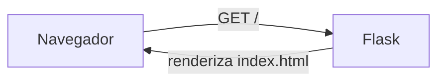
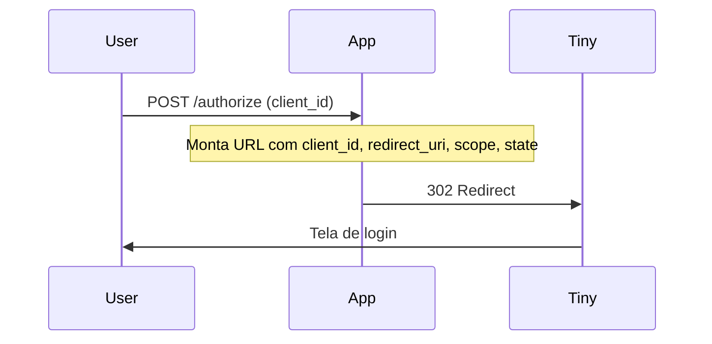
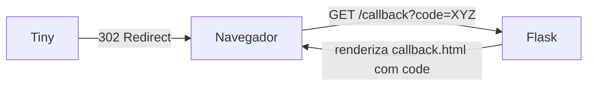

# Passo a Passo — Gerar Authorization Code do Tiny ERP

Guia detalhado para obter um `authorization code` do Tiny ERP usando esta aplicação.

---

## Pré-requisitos

- Python 3.9 ou superior instalado
- Um `client_id` válido registrado no Tiny ERP

---

## 1. Clone e instale as dependências

```bash
git clone <repositorio>
cd olist-tiny-code-auth
pip install -r requirements.txt
```

O `requirements.txt` instala:
- `Flask==3.0.3` — framework web
- `pytest==8.2.0` — para rodar os testes automatizados

## 2. Inicie a aplicação

```bash
python app.py
```

Saída esperada:

```
 * Running on http://0.0.0.0:5000
```

> Para deploy em produção no Vercel, o entrypoint é `index.py`. Não é necessário iniciar manualmente.

## 3. Acesse o formulário

Abra o navegador em `http://localhost:5000`.

Você verá um formulário com o campo **Client ID**.



## 4. Informe o Client ID

1. Cole o `client_id` do seu app registrado no Tiny ERP
2. Clique em **Gerar Código de Autorização**

A aplicação monta a URL de autenticação e redireciona o navegador:

```
https://accounts.tiny.com.br/realms/tiny/protocol/openid-connect/auth
  ?client_id=SEU_CLIENT_ID
  &redirect_uri=http://localhost:5000/callback
  &scope=openid
  &response_type=code
  &state=TOKEN_ANTI_CSRF
```



## 5. Autentique-se no Tiny

Na tela de login do Tiny ERP:
- Informe seu usuário e senha
- Autorize o acesso solicitado

## 6. Receba o Authorization Code

Após a autenticação, o Tiny redireciona de volta para:

```
http://localhost:5000/callback?code=SEU_AUTHORIZATION_CODE
```

A página exibe o código com um botão **Copiar Código**.



## 7. Próximo passo: trocar o code pelo access_token

Com o `authorization code` em mãos, faça uma requisição `POST` para o endpoint de token do Tiny:

```bash
curl -X POST https://accounts.tiny.com.br/realms/tiny/protocol/openid-connect/token \
  -H "Content-Type: application/x-www-form-urlencoded" \
  -d "grant_type=authorization_code" \
  -d "client_id=SEU_CLIENT_ID" \
  -d "client_secret=SEU_CLIENT_SECRET" \
  -d "code=AUTHORIZATION_CODE_RECEBIDO" \
  -d "redirect_uri=http://localhost:5000/callback"
```

Resposta esperada:

```json
{
  "access_token": "...",
  "expires_in": 300,
  "refresh_token": "...",
  "token_type": "Bearer"
}
```

---

## Executar testes

```bash
python -m pytest test_app.py -v
```

Resultado:

```
test_app.py::TestIndexRoute::test_index_returns_200 PASSED
test_app.py::TestIndexRoute::test_index_contains_form PASSED
test_app.py::TestAuthorizeRoute::test_missing_client_id_returns_400 PASSED
test_app.py::TestAuthorizeRoute::test_empty_client_id_returns_400 PASSED
test_app.py::TestAuthorizeRoute::test_valid_client_id_redirects PASSED
test_app.py::TestCallbackRoute::test_missing_code_returns_400 PASSED
test_app.py::TestCallbackRoute::test_error_param_returns_400 PASSED
test_app.py::TestCallbackRoute::test_error_with_description PASSED
test_app.py::TestCallbackRoute::test_valid_code_shows_code PASSED
test_app.py::TestCallbackRoute::test_callback_error_has_text_plain_header PASSED
test_app.py::TestBuildAuthUrl::test_returns_valid_url PASSED
test_app.py::TestBuildAuthUrl::test_all_params_are_encoded PASSED
```

---

## Troubleshooting

| Problema                              | Causa provável                          | Solução                                       |
|---------------------------------------|------------------------------------------|-----------------------------------------------|
| `Client ID é obrigatório`            | Campo vazio no formulário                | Informe um client_id válido                   |
| `Erro na autorização: access_denied`  | Usuário negou autorização no Tiny        | Tente novamente e aceite a autorização        |
| `Nenhum código de autorização`        | Tiny não retornou o code                 | Verifique se o redirect_uri está correto      |
| Página não carrega no Vercel         | Build falhou ou rota não configurada     | Confira `vercel.json` e os logs do deploy     |
